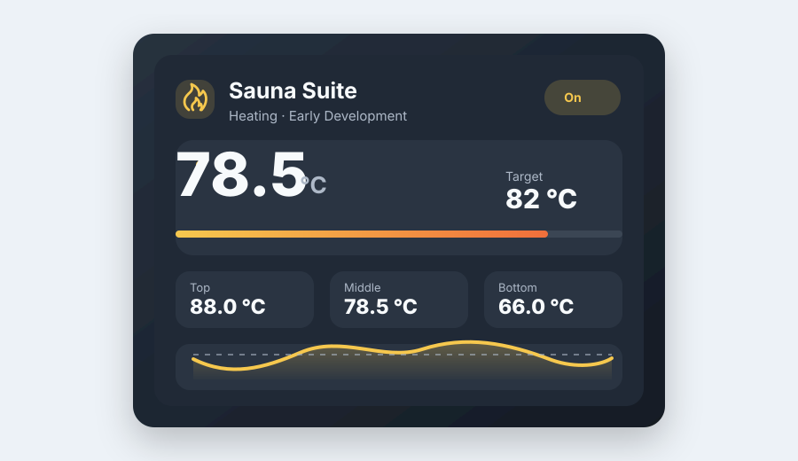

# Sauna Suite

Sauna Suite is an open-source Home Assistant project for a professional,
modular and HACS-compatible sauna dashboard experience.

This repository currently contains a Lovelace custom card named
`custom:sauna-suite-card` with manual controls, multi-zone temperature
monitoring, target-temperature adjustment and a compact Recorder-backed trend.



## Status

Early development. This version provides manual user controls and monitoring
only. It does not automatically switch the sauna heater, regulate temperature,
run schedules, control RGB lights, play alarms, calculate ETA or optimize
energy, PV or battery usage.

## Planned Capabilities

- Lovelace custom card
- Visual card editor
- Multiple sauna temperature sensors for top, middle and bottom zones
- Optional outside-temperature sensor
- Weighted temperature calculation
- Intelligent heat-up time estimation
- Optional Home Assistant temperature control
- RGB light signaling
- HomePod or generic media-player alarm with acknowledgement
- Sauna session tracking
- General power sensor in kW
- Fixed sauna-heater rated power
- PV and battery-storage optimization
- Planned sauna sessions
- Analytics and diagnostics

## Installation

### HACS Custom Repository

Sauna Suite is intended to be installed as a HACS custom repository until it is
available through the default HACS repository list.

1. Open HACS in Home Assistant.
2. Open the three-dot menu and choose **Custom repositories**.
3. Add this repository URL:

   ```text
   https://github.com/Fceeb/sauna-suite
   ```

4. Select the repository category **Dashboard**.
5. Install Sauna Suite from HACS.
6. Add the Lovelace resource if Home Assistant does not add it automatically:

   ```text
   /hacsfiles/sauna-suite/sauna-suite.js
   ```

   Resource type:

   ```text
   JavaScript module
   ```

Releases will provide the HACS-ready file named `sauna-suite.js`. The
`hacs.json` manifest points to that release asset.

### Manual Development Installation

For local development:

```bash
npm install
npm run build
```

The development build writes the bundle to:

```text
dist/sauna-suite.js
```

Copy the built file into your Home Assistant `www` directory, for example:

```bash
cp dist/sauna-suite.js /config/www/sauna-suite.js
```

Then add this Lovelace resource:

```text
/local/sauna-suite.js
```

Resource type:

```text
JavaScript module
```

## Configuration Example

All settings can be configured through the visual editor. YAML is optional for
manual setups:

```yaml
type: custom:sauna-suite-card
name: Sauna Suite
main_switch_entity: switch.sauna_main
temperature_top_entity: sensor.sauna_temperature_top
temperature_middle_entity: sensor.sauna_temperature_middle
temperature_bottom_entity: sensor.sauna_temperature_bottom
outside_temperature_entity: sensor.outside_temperature
target_temperature_entity: number.sauna_target_temperature
control_temperature_mode: weighted_average
weight_top: 3
weight_middle: 2
weight_bottom: 1
show_outside_temperature: true
show_temperature_zones: true
near_target_threshold: 5
target_reached_tolerance: 2
above_target_threshold: 2
show_temperature_trend: true
trend_history_minutes: 120
trend_refresh_minutes: 5
confirm_switch_on: true
```

Supported `control_temperature_mode` values:

- `top`
- `middle`
- `bottom`
- `average`
- `weighted_average`
- `minimum`
- `maximum`

Weighted averages use only sensors with valid numeric states. Missing,
`unavailable`, `unknown` and non-numeric sensor states are ignored instead of
being treated as zero.

## Manual Controls

The power button manually toggles the configured `main_switch_entity`.
Supported domains are `switch` and `input_boolean`.

Switching on requires confirmation by default. Switching off happens directly.
These actions call only:

- `switch.turn_on` / `switch.turn_off`
- `input_boolean.turn_on` / `input_boolean.turn_off`

The target-temperature controls write only to the configured
`target_temperature_entity`. Supported domains are `number` and `input_number`.
The card uses the entity's `min`, `max` and `step` attributes for clamping,
rounding, plus/minus buttons and the optional slider.

The target setting is not used to switch or regulate sauna equipment
automatically.

## Temperature Trend

The compact trend uses the Home Assistant Recorder history API for recent
control-temperature samples. Recorder remains the source of historical values;
Sauna Suite does not store long-term history in local storage.

If Recorder or history is unavailable, the card still works and shows an empty
trend state.

## Development

```bash
npm run lint
npm run typecheck
npm test
npm run build
```

## Card

The card is registered as:

```yaml
type: custom:sauna-suite-card
name: Sauna Suite
```

## License

MIT
