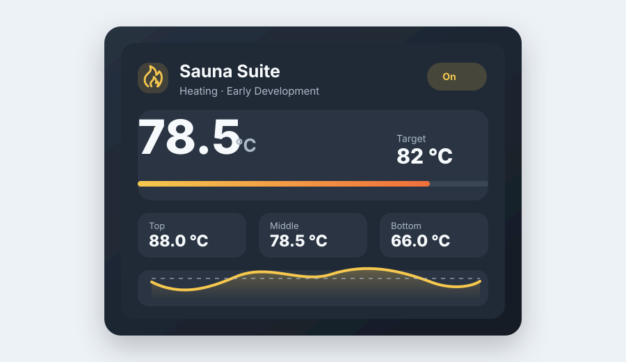

# Sauna Suite

Sauna Suite is an open-source Home Assistant project for a professional,
modular and HACS-compatible sauna dashboard experience.

This repository currently contains a Lovelace custom card named
`custom:sauna-suite-card` with manual controls, multi-zone temperature
monitoring, target-temperature adjustment, a redesigned compact interface, a Recorder-backed trend for direct sensor modes and a deterministic heat-up ETA estimate.
It can also optionally control one Home Assistant color-capable `light` entity
for visual RGB status signaling and a ready-temperature signal.



## Alpha Status

Version `0.5.0-alpha.1` is the current HACS-installable alpha release. It adds unified ready-event acknowledgement and optional media-player ready notifications without adding automatic equipment control. Expect breaking changes while the dashboard model and editor mature.

This version provides manual user controls and monitoring only. It does not
automatically switch the sauna heater, regulate temperature, run schedules,
play audio alarms, start schedules or optimize energy, PV or battery usage.
RGB support is visual signaling only and never switches, regulates or
influences the sauna heater.
Audio/media notifications are also signaling only.

## Planned Capabilities

- Lovelace custom card
- Visual card editor
- Multiple sauna temperature sensors for top, middle and bottom zones
- Optional outside-temperature sensor
- Weighted temperature calculation
- Intelligent heat-up time estimation
- Optional Home Assistant temperature control
- RGB light signaling
- HomePod or generic media-player alarm with acknowledgement
- Sauna session tracking
- General power sensor in kW
- Fixed sauna-heater rated power
- PV and battery-storage optimization
- Planned sauna sessions
- Analytics and diagnostics

## Installation

### HACS Custom Repository

Sauna Suite is installed as a HACS custom repository.

1. Open HACS in Home Assistant.
2. Open the three-dot menu and choose **Custom repositories**.
3. Add this repository URL:

   ```text
   https://github.com/Fceeb/sauna-suite
   ```

4. Select repository type/category **Dashboard**.
5. Install Sauna Suite from HACS.
6. Add the Lovelace resource if Home Assistant does not add it automatically:

   ```text
   /hacsfiles/sauna-suite/sauna-suite.js
   ```

   Resource type:

   ```text
   JavaScript module
   ```

Releases provide the HACS-ready file named `sauna-suite.js`. The `hacs.json`
manifest points HACS to that release asset.

After installation or update, refresh the Home Assistant frontend. A full page
reload is usually enough; if Home Assistant still serves an old file, clear the
browser cache or use a hard refresh.

### Manual Development Installation

For local development:

```bash
npm install
npm run build
```

The development build writes the bundle to:

```text
dist/sauna-suite.js
```

Copy the built file into your Home Assistant `www` directory, for example:

```bash
cp dist/sauna-suite.js /config/www/sauna-suite.js
```

Then add this Lovelace resource:

```text
/local/sauna-suite.js
```

Resource type:

```text
JavaScript module
```

Restarting Home Assistant is usually not required for a Lovelace resource, but
a dashboard reload or frontend refresh is required after replacing the
JavaScript file.

## Card Type

Use this Lovelace card type:

```yaml
type: custom:sauna-suite-card
```

## Basic Configuration Example

All settings can be configured through the visual editor. YAML is optional for
manual setups:

```yaml
type: custom:sauna-suite-card
name: Sauna Suite
main_switch_entity: switch.sauna_main
temperature_top_entity: sensor.sauna_temperature_top
temperature_middle_entity: sensor.sauna_temperature_middle
temperature_bottom_entity: sensor.sauna_temperature_bottom
outside_temperature_entity: sensor.outside_temperature
target_temperature_entity: number.sauna_target_temperature
general_power_sensor_entity: sensor.house_power
control_temperature_mode: weighted_average
weight_top: 3
weight_middle: 2
weight_bottom: 1
show_outside_temperature: true
show_temperature_zones: true
heating_power_mode: fixed
fixed_heater_power_kw: 9
heater_rated_power_kw: 9
outside_temperature_weight: 0.15
show_eta: true
show_ready_time: true
show_heating_rate: true
eta_minimum_samples: 5
eta_history_minutes: 30
near_target_threshold: 5
target_reached_tolerance: 2
show_temperature_trend: true
trend_history_minutes: 120
trend_refresh_minutes: 5
confirm_switch_on: true
rgb_enabled: true
rgb_light_entity: light.sauna_rgb
rgb_mode: temperature_gradient
rgb_brightness: 80
rgb_update_interval_seconds: 5
rgb_restore_previous_state: true
rgb_only_when_sauna_on: true
ready_signal_enabled: true
ready_signal_mode: hold
ready_signal_color: green
ready_signal_brightness: 100
ready_signal_interval_seconds: 1
ready_signal_duration_seconds: 30
ready_signal_requires_acknowledgement: true
ready_signal_repeat: false
ready_signal_repeat_interval_seconds: 60
acknowledgement_mode: card_or_entity
acknowledgement_entity: input_button.sauna_quittieren
show_acknowledge_button: true
media_notification_enabled: true
media_player_entity: media_player.sauna_homepod
tts_entity: tts.piper
media_notification_mode: tts
media_notification_message: 'Die Sauna ist bereit.'
media_notification_volume: 0.5
media_notification_repeat: true
media_notification_repeat_interval_seconds: 60
media_notification_stop_on_acknowledge: true
media_notification_restore_volume: true
```

Supported `control_temperature_mode` values:

- `top`
- `middle`
- `bottom`
- `average`
- `weighted_average`
- `minimum`
- `maximum`

Weighted averages use only sensors with valid numeric states. Missing,
`unavailable`, `unknown` and non-numeric sensor states are ignored instead of
being treated as zero.

## Manual Controls

The power button manually toggles the configured `main_switch_entity`.
Supported domains are `switch` and `input_boolean`.

Switching on requires confirmation by default. Switching off happens directly.
These actions call only:

- `switch.turn_on` / `switch.turn_off`
- `input_boolean.turn_on` / `input_boolean.turn_off`

The target-temperature controls write only to the configured
`target_temperature_entity`. Supported domains are `number` and `input_number`.
The card uses the entity's `min`, `max` and `step` attributes for clamping,
rounding, plus/minus buttons and the optional slider.

The target setting is not used to switch or regulate sauna equipment
automatically.

## Heating ETA

Sauna Suite can show a deterministic heat-up ETA for direct sensor modes
(`top`, `middle` or `bottom`). The estimate uses recent Home Assistant
Recorder history for the selected physical control-temperature sensor and a
robust recent heating rate. Calculated modes (`average`,
`weighted_average`, `minimum` and `maximum`) still do not have aggregated
Recorder history yet, so ETA and trend history remain unavailable there.

The base ETA is remaining temperature divided by the measured recent heating
rate. Two small bounded corrections are then applied:

- Outside-temperature correction: bounded to 0.85-1.25.
- Effective-power correction: bounded to 0.75-1.5.

Power can be configured as a fixed heater power in kW or estimated from a
general power sensor. General power sensor mode supports W and kW units, caps
the usable sauna share at `heater_rated_power_kw` and is only an approximation
because it does not isolate other household loads. If the configured main switch
is off, effective sauna heating power is treated as 0.

ETA is unavailable when the target is already reached, the heater switch is off,
Recorder history has too few samples, the measured heating rate is not positive
enough or required temperatures/power values are unavailable. Target reached is
shown as "Ready".

This feature remains monitoring and manual-control only. It does not switch,
regulate or schedule sauna equipment automatically.

## RGB Status And Ready Signal

RGB support is optional and uses only the standard Home Assistant
`light.turn_on` and `light.turn_off` services. Configure one color-capable
`light` entity through the visual editor or YAML. Sauna Suite detects supported
color capabilities and uses `rgb_color` when available, then `hs_color`. Lights
that only support `color_temp` are treated as unsupported for this feature
because the sauna statuses depend on distinct semantic colors such as blue,
green, gold and red.

`temperature_gradient` mode maps progress toward the configured target
temperature to a smooth semantic color range: blue while far below target,
cyan/green while heating, yellow near target, warm green/gold at target and
orange/red above target. `ready_only` mode leaves the light alone until the
ready-temperature signal triggers.

When `rgb_restore_previous_state` is enabled, the card stores the previous
light state in memory before it first takes control and restores it when RGB
signaling stops where possible. This state is not persisted across Home
Assistant reloads or browser sessions.

The ready signal triggers only on a transition from not ready to ready while
the main switch is on. It does not retrigger continuously while the sauna
remains at target temperature. A new ready event becomes eligible after the
temperature falls below `target - near_target_threshold` or after the sauna is
turned off and on again.

Acknowledgement is local runtime state in this alpha. If acknowledgement is
enabled, the card shows a compact **Acknowledge** action while the ready signal
is active. Acknowledging stops the signal, optionally restores the previous
light state and prevents repeat signals until the reset hysteresis applies.

## Ready Notifications And Acknowledgement

Sauna Suite uses one runtime ready event for RGB, media-player notifications
and future notification channels. A single acknowledgement from the card or a
configured Home Assistant entity acknowledges that ready event and stops all
active notification channels.

Supported acknowledgement entities are `input_button`, `button`,
`input_boolean` and `binary_sensor`. This allows external dashboard buttons,
wall controls, automations, scripts and voice-assistant workflows. Recommended
helpers include `input_button.sauna_quittieren` or
`input_boolean.sauna_quittieren`. Sauna Suite does not create helpers
automatically; select an existing entity in the visual editor.

Entity acknowledgement is event-aware. An entity that was already active before
the ready event started does not acknowledge the new event. For
`input_boolean`, acknowledgement requires a fresh `off` to `on` transition; it
can optionally be reset to `off` after acknowledgement.

Media notifications use standard Home Assistant services. TTS uses `tts.speak`
with a user-selected `tts` entity, so no cloud provider is hard-coded. Media
mode uses `media_player.play_media` with a configured media ID or media-source
identifier. Compatible HomePods work through their existing Home Assistant
`media_player` integration.

Messages support the local Sauna Suite placeholders `{temperature}`, `{target}`,
`{eta}` and `{ready_time}`. Arbitrary Home Assistant/Jinja templates are not
executed in the frontend.

The card can temporarily set media-player volume before playback and restore
the previous volume where practical. On acknowledgement it can call
`media_player.media_stop`, but Home Assistant media-player integrations do not
always expose enough information to prove playback ownership, so this is a
best-effort stop for the active notification.

Acknowledgement state is runtime-only and is not persisted across reloads.

## Temperature Trend

The redesigned compact trend uses the Home Assistant Recorder history API for recent
temperature samples. In this version, trends are available only when
`control_temperature_mode` is `top`, `middle` or `bottom`, because those modes
map to one physical sensor.

For calculated modes (`average`, `weighted_average`, `minimum` and `maximum`),
the card does not show a single sensor history as if it were the calculated
control-temperature trend. Multi-sensor history aggregation is planned for a
later release.

If Recorder or history is unavailable, the card still works and shows an empty
trend state.

## Troubleshooting

### Custom element does not exist

Confirm the Lovelace resource is registered and points to the installed file:

```text
/hacsfiles/sauna-suite/sauna-suite.js
```

Then refresh the dashboard. If the error remains, update to
`0.1.0-alpha.2` or newer. Alpha.2 fixes incorrect custom-card metadata that
could make the Home Assistant card picker freeze with
`Custom element not found: custom:sauna-suite-card`.

### Card picker freezes

Update to `0.1.0-alpha.3` or newer. Alpha.3 fixes an infinite preview render
loop that could freeze the Home Assistant **By card** picker when the preview
card was created without `hass` or configured trend entities.

### Resource not loaded

Check that HACS installed Sauna Suite as a **Dashboard** custom repository and
that the release asset is named `sauna-suite.js`. The resource type must be
`JavaScript module`.

### Old JavaScript file cached

Use a hard browser refresh, clear the browser cache or open the dashboard in a
private window. Mobile companion apps may also need their frontend cache
refreshed after an update. If the card still shows the older alpha layout after
updating to `0.3.0-alpha.1`, Home Assistant is likely still serving the cached
JavaScript file.

### Duplicate custom-element registration

Update to `0.1.0-alpha.2` or newer if the browser console reports that a custom
element has already been defined. Alpha.2 guards internal custom-element
registration so loading the bundle twice no longer throws.

### Recorder trend or ETA unavailable

Trend and ETA require Home Assistant Recorder history for the selected direct
sensor mode (`top`, `middle` or `bottom`). Calculated modes intentionally do not
show aggregated history yet. If Recorder is disabled, purged or unavailable,
the rest of the card still works.

## Development

```bash
npm run format:check
npm run lint
npm run typecheck
npm test
npm run build
```

## License

MIT
